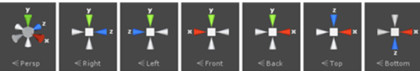
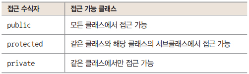

# UnityMidExam
## 중간고사 출제 영역 정리
### **출제 방식**
   1. 객관식(오지선다형)
      - 1점 5문제
   2. 단답형
      - 2점 5문제
   3. 서술형
      - 5점 3문제
 

### **출제 영역**
  1. VR 관련 역사 인물 및 기술 방식
  2. 오브젝트 Tool 기능 버튼 이름 및 기능
  3. 5가지 화면 이름 및 기능
  4. 스크립트 3가지 종류
  5. C# 클래스 맴버 접근 수식자
  6. 게임 기획/설계하는 5단계 과정
  7. 오브젝트, UI, 프리팹 적용하는 과정
 
 

##  VR 관련 역사 인물 및 기술 방식
### 가상 현실의 의미
- **VR**
  - Virtual Reality, 가상 + 현실
- **재런 래니어(Jaron Lanier)**
   - 가상현실의 개념을 대중화시킨 사람
 

### 실감 나는 이미지와 영상(1838 ~ 1950)
- **Stereoscopic Vision**
  - 영국의 물리학자 **찰스 휘트스톤(Charles Wheatstone)** 이 논문을 통해 발표
  - 1838년 **양안시차(Stereoscopic Vision) 원리** 를 도구로 만들어 실험
- **Stereoscope**
  - **사진술(Photography)** 의 발달과 함께 만들어 짐
  - 사진 기술의 발달로 사진 촬영이 쉬워지면서 공포사진, 섹시 콘텐츠 등 당시 촬영한 사진들이 발견되고 있다.
- **Anaglyph**
  - **애너글리프(Anaglyph) 방식** 은 안경이 각각 청색과 적색 색깔을 걸러내고 좌우 영상을 분리하면서 각각의 눈이 다른 이미지를 보는 원리
- **Polarized Method**
  - 회색의 폴라로이드 필터를 사용한 편광방식
- **Reel**
  - **릴(Reel)** 은 가운데 원을 기준으로 서로 매칭되는 이미지들이 각각 왼쪽 오른쪽 눈에 비치면서 최종적으로 사용자에게 입체 이미지를 보여주게 된다.
 

### 본격적으로 등장하는 가상현실 기기들(1960 ~ 1990)
- **Telepresence**
  - **필코(Philco)** 에서 1961년도에 제작한 **텔레프레전스(Telepresence) 시스템** 이다.
  - 머리의 움직임에 맞춰 외부의 비디오카메라가 움직이면서 영상을 볼 수 있는 방식
- **Sensorama**
  - 1962년 개발한 **센소라마(Sensorama)** 라는 입체 영상 기기이다.
  - 3D Stereoscopic 기반의 영상 외에도 모션과 향기, 바람, 진동, 스테레오 사운드 기능을 지원했다.
- **Experimental 3-D display**
  - 1961년 **필코(Philco)** 의 **Headsight** 외에도 초창기 **HMD(Head Mounted Display)** 라고 볼수 있는 기기가 1968년 등장했다.
- **Videoplace**
  - 1970년대에 **마이론 크루거(Myron W. Krueger)** 가  라는 실험 공간을 제작한 바 있다.
  - 체험자의 손이 컴퓨터 스크린에 나타나고, 손을 이용하여 가상의 물체와 상호작용할 수 있다.
  - 크루거는 이러한 환경을 **인공현실(Artificial Reality)** 이라고 표현했다.
- **Leep**
  - 1979년에는 **에릭 휴렛(Eric Howlett)** 이 의도적으로 **색수차(chromatic aberration)** 를 준 입체 사진을 찍고 이 필름을 전용 뷰어를 통해서 보면 렌즈가 다시 색수차를 보정하는 과정에서 넓은 시야각을 얻을 수 있는 **LEEP 시스템** 을 만들었다.
  - 기존 사진들의 시야각이 평균 20도에서 50도였는데 이를 획기적으로 늘렸다.
- **VIEW**
  - 1984년 **NASA Ames 산하의 VIEW(Virtual Interface Environment Workstation) Lab** 에서 HMD를 통해 고개의 움직임을 일치시켜 주변을 살펴보고, 조이스틱을 이용해 로봇을 원격으로 이동 시키기도 하였다.
 

### 일반 소비자 시장에 도전하는 기기들 (1990~2000)
- 아케이드 시장 출시
  - 1991년 버추얼리티 그룹(Virtuality Group)에서 제작한 여러 종류의 게임들이 아케이드에 설치되었다
 

### 새로운 업체들의 등장 (2000~)
- **Oculus Rift/Quest2**
  - 2012년 E3에서 큰 주목을 받은 **오큘러스 리프트(Oculus Rift)** 는 펀딩을 시작하게 된다.
- **VIVE**
  - HTC와 밸브(Valve)가 2년여 동안 협업하여 Vive를 출시.
  - 가상현실을 두 발로 걸어 다닐 수 있는 **‘룸스케일(Room Scale)’** 기능 추가
- **PS VR**
  - Sony의 가정용 게임 기기인 PlayStation4 와 결합한 PS VR 출시
  - 가격대를 낮춰 소비자들에게 호의적인 반응을 이끌어냄.
 
 

## 5가지 화면 이름 및 기능
### 유니티 화면 구성
유니티의 화면 구성은 다음과 같이 크게 Scene 뷰&Game 뷰, Hierarchy 창, Project 창&Console 창, Inspector 창 네 개로 나뉨

- **Scene 뷰(씬 뷰)**
  - 게임을 구성하는 메인 화면
  - 주로 리소르를 배치해 씬을 작성
  - 뷰 위쪽의 탭을 클릭해 Game 뷰 등을 볼 수 있음
- **Game 뷰(게임 뷰)**
  - 게임을 실행했을 때 보이는 방향을 확인할 수 있음
  - 이외에도 게임의 처리 속도나 과부하가 걸리는 곳 등을 분석할 수 있음
- **Hierarchy 창(하이어라키 창, 계층 구조 창)**
  - Scene 뷰에 배치한 오브젝트 이름을 목록으로 표시
  - 오브젝트 사이의 계층 구조를 표시하거나 편집할 수도 있음
- **Project 창(프로젝트 창)**
  - 게임에서 사용하는 리소스를 관리
  - 이미지나 음원 등 리소스를 드래그&드롭하면 게임 리소스로 추가
  - Unity engine에서 유일하게 하드 디스크와 링크된 뷰
- **Inspector 창(인스펙터 창)**
  - Scene 뷰에서 선택한 오브젝트의 상세 정보가 나타남
  - Inspector 창에서 오브젝트의 좌표, 회전, 크기(스케일), 색, 모양 등을 설정
- **Console 창(콘솔 창)**
  - 프로그램에 오류가 있을 때 그 내용을 표시
  - 프로그램에 따라 임의의 수치나 문자열을 표시할 수도 있음
- **조작 도구**
  - Scene 뷰에 배치한 오브젝트의 좌표, 회전, 크기를 조절할 수 있고, Scene 뷰의 보이는 방향을 조정할 수 있음
- **실행 도구**
  - 게임을 실행하거나 정지시킴
 
 

## 오브젝트 Tool 기능 버튼 이름 및 기능
### **Scene View 제어**

- 예시 문제
  - Q. 단축키와 기능을 매칭하시오.
  - A. Ctrl+P 게임플레이 / F 프레임 선택 / Ctrl+Shift+P 일시정지 / Ctrl+D 복제
 

### **실행 도구**

- **Move, Rotate, Scale Tool** 

  - 단축키를 이용해 여러 툴을 사용해 객체를 제어할 수 있다.
    - 이동 (Move Tool - 단축키 : w)
    - 회전 (Rotate Tool - 단축키 : E)
    - 스케일 (Scale Tool - 단축키 : R)
  - 카메라는 크기가 고정 되어 있어 스케일 변경이 불가능하다.
  - 키보드를 통해 Inspector View의 Transform 속성 값을 변경하면 이동, 회전, 스케일 제어가 가능하다.
- **Rect Tool** 

  - Rect Tool을 이용하면 주변의 객체를 이동시키고, 크기를 변경하고, 회전하는 등의 일을 모두 할 수 있다.(Move, Rotate, Scale Tool 기능 모두 사용 가능)
- **Gizmo(가즈모)** 

Scene View에는 카메라, 조명, 사운드 등과 오브젝트의 방향 등 보이지 않는 요소를 시각적으로 나타내기 위한 아이콘을 기즈모(Gizmo)를 사용한다.
  - 빨강(red)
    - x축 - 수평 방향 : 오른쪽이 + 방향
  - 초록(green)
    - y축 - 수직 방향 : 위쪽이 + 방향
  - 파랑(blue)
    - z축 - 깊이 / 폭 : 모니터 안쪽이 + 방향
 
 

## 게임 기획/설계하는 5단계 과정
- 1단계: 화면에 놓일 오브젝트를 모두 나열
- 2단계: 오브젝트를 움직일 수 있는 컨트롤러 스크립트를 정함
- 3단계: 오브젝트를 자동으로 생성할 수 있도록 제너레이터 스크립트를 정함
- 4단계: UI를 갱신할 수 있도록 감독 스크립트를 준비
- 5단계: 스크립트를 만드는 흐름을 생각
 
 

## 스크립트 3가지 종류
- 컨트롤러 스크립트
  - 오브젝트의 움직임을 제어하는 스크립트
- 제너레이터 스크립트
  - 게임을 플레이할 때 나타나는 오브젝트를 생성하는 스크립트
- 감독 스크립트
  - 게임의 UI(사용자 인터페이스)를 조작하거나 진행 상황을 판단하는 스크립트
 
 

## c# 클래스 맴버 접근 수식자
- 접근 수식자를 생략하면 private으로 간주되므로 공개하고 싶은 변수와 메서드가 있다면 public 수식자를 붙이는 것이 좋음 

 
 

## 오브젝트, UI, 프리팹 적용하는 과정
- 오브젝트를 만드는 방법
	- Scene 뷰에 오브젝트를 배치
	- 오브젝트를 움직이는 방법을 쓴 스크립트를 작성
	- 작성한 스크립트를 오브젝트에 적용
- UI 만드는 방법
	- UI 부품을 Scene 뷰에 배치
	- UI를 갱신하는 감독 스크립트를 작성
	- 빈 오브젝트를 만들고 작성한 스크립트를 적용
- 프리팹 생성 방법
	- 이미 있는 오브젝트를 사용해 프리팹을 만듦
	- 제너레이터 스크립트를 만듦
	- 빈 오브젝트에 제너레이터 스크립트를 적용
	- 제너레이터 스크립트에 프리팹을 전달
	